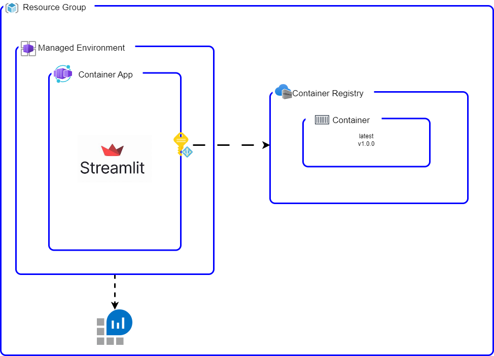

# Docusaurus-aca (Docusaurus in Azure Container App)

This repository includes a simple Docusaurus Site with a basic template for hosting product documentation. The repo structure is planned for developing using within the [Dev Container](https://code.visualstudio.com/docs/devcontainers/containers)/[Codespaces](https://code.visualstudio.com/docs/remote/codespaces) and deploy using [Azure Developer CLI](https://learn.microsoft.com/azure/developer/azure-developer-cli/install-azd).

## Basic documentation structure

```bash
src/docusaurus/docs
├── 01-intro.md
├── 02-getting-started
├── 03-tutorials
├── 04-docs
└── 05-contributing
```

## Local Development

All dependencies are installed as part of the devcontainer bootstrap. So, for starting the site:

```bash
cd src/docusaurus
make dev
```

Now you can visit localhost:3000

### Linters and spellcheck

```bash
make lint
make spellcheck
# fix common linting issues
make lint-fix
```

## Deploy to azure

Everything is deploy and manage through `AZD`. The main configuration file is `azure.yaml`. If you want to have a look into the schema and options please have a read [here](https://learn.microsoft.com/en-us/azure/developer/azure-developer-cli/azd-schema)

### Step by step

1. connect AZD to azure

    ```bash
    azd auth login
    ```

2. validate the package is able to get containerize (will use latest tag -> if other tag required, please `export RELEASE_VERSION=<your tag>`). The pre package hook, will set the environment to tag the container image as `docusaurus-aca:<your tag>`.

    ```bash
    azd package
    ```

3. create the azure resources

    ```bash
    # when running the ocommand, you'll need to configure the subs/location
    # by default the bicep templates will create a revision with a sample image
    azd provision
    ```

4. deploy the application

    ```bash
    azd deploy
    ```

### Short Cut

```bash
azd up
```

## Configuring Github Workflow

This will allow you to configure a service principal in azure and federate it to your github account. After you finish the configuration, you can see a set of variables set in the repository.

```bash
azd pipeline config
```

## Infrastructure

All the infrastructure that is being deployed can be found in the `infra` directory. In summary it creates:

- Azure Container App
- Azure Container App Environment
- Managed Identity (with pull role to the ACR)
- Azure Container Registry
- Log Analytics


